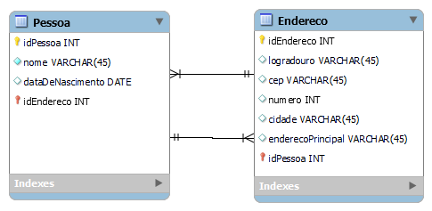

 

  

 

<h2>Descrição do Projeto</h2>

O projeto consiste no desenvolvimento de uma API REST para cadastro de pessoas e endereços. Utilizando o padrão Spring MVC, Spring Boot framework, DB H2 e Swagger.

<h2>Diagrama de Classes</h2>
 

  

<h2>Documentação Swagger</h2>

<a href="http://localhost:8080/swagger-ui/index.html">Link</a> para o Swagger UI.

<h2>Dependências usadas no projeto:</h2>

* Spring Web
* Spring Data JPA
* Spring Boot DevTools
* Lombok
* H2 Database

<h2>Postman</h2>

* As colections do Postman estão em assets/

<h2>Requisitos do projeto:</h2>

Esta análise propõe avaliar os seguintes temas: 
1. Qualidade de código
2.	Java, Spring boot
3. API REST
4.	Testes

A entrega deverá ser feita da seguinte forma:
*	O prazo para entrega da avaliação será de até 7 dias após envio da mesma
*	Encaminhar este documento com as perguntas respondidas e com o link do código público em sua conta do GitHub
*	Opcionalmente, caso você consiga fazer o build da aplicação, poderá também informar o link de acesso

Qualidade de código! (As perguntas abaixo são obrigatórias e deverão ser entregues junto com o projeto)

1.	Durante a implementação de uma nova funcionalidade de software solicitada, quais critérios você avalia e implementa para garantia de qualidade de software?

2.	Em qual etapa da implementação você considera a qualidade de software?

Desafio Java:

Usando Spring boot, crie uma API simples para gerenciar Pessoas. Esta API deve permitir:  
*	Criar uma pessoa
*	Editar uma pessoa
*	Consultar uma pessoa
*	Listar pessoas
*	Criar endereço para pessoa
*	Listar endereços da pessoa
*	Poder informar qual endereço é o principal da pessoa?  

Uma Pessoa deve ter os seguintes campos:  
*	Nome
*	Data de nascimento
*	Endereço:
*	Logradouro
*	CEP
*	Número
*	Cidade

Requisitos  
*	Todas as respostas da API devem ser JSON  
*	Banco de dados H2

Diferencial
*	Testes
*	Clean Code
 
Será levado em avaliação 
*	Estrutura, arquitetura e organização do projeto  
*	Boas práticas de programação  
*	Alcance dos objetivos propostos.
